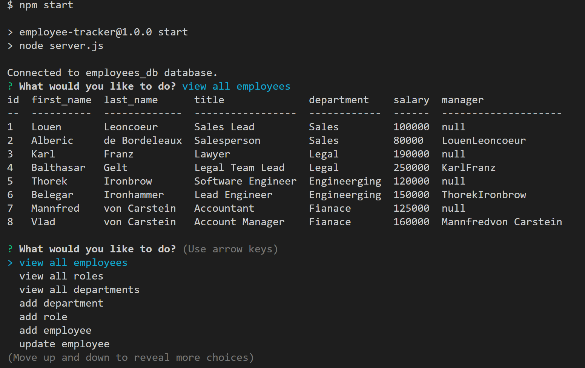

# Employee Tracker

[](https://opensource.org/licenses/MIT)



## Description
This node based application is used to track employees, roles, and departments in a company database. I built this to work with node.js and MySQL databases.

[Watch the demo!](https://watch.screencastify.com/v/1EtMSAikLeFTWFFtZ4f7)

## Technology Used
* Node.js
* Inquirer
* MySQL

## Code Snippet

This is a function that utilizes a class of DB along with a method findAllDepartments to display a table in the database

```JavaScript
function viewDepartments() {
  const newDb = new DB();
  newDb.findAllDepartments().then(([rows]) => {
    let employees = rows;
    console.table(employees);
  });
```
Here is the method used in the above example. It returns a query that has SQL syntax to display specified columns in the department table.

```JavaScript
findAllDepartments() {
    return this.connection
      .promise()
      .query("SELECT department.id, department.name FROM department;");
  }
```

## Author Links

[Github](https://github.com/mattjgatsby)
[LinkedIn](https://www.linkedin.com/in/matthew-gatsby-1a1521250/)